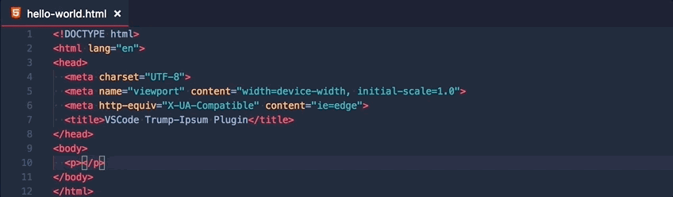

# vs-code-trump-ipsum README

"Vs Code Trump Ipsum" is a VS Code plugin that can create placeholder text for your files. It is inspired of the build-in "Lorem ipsum" feature, but uses the TrumpIpsum service found here http://trumpipsum.net/.

## Features

"Vs Code Trump Ipsum" adds two features to Vscode:
### Get Paragraph
Adds a desired number of paragraphs of text to the current open editor.

### Get Text
Adds a desired number of characters to the current open editor

## Known Issues
* Sometimes text might be added with a whitespace in front.

## Changelog
Checkout the [changelog](CHANGELOG.md).